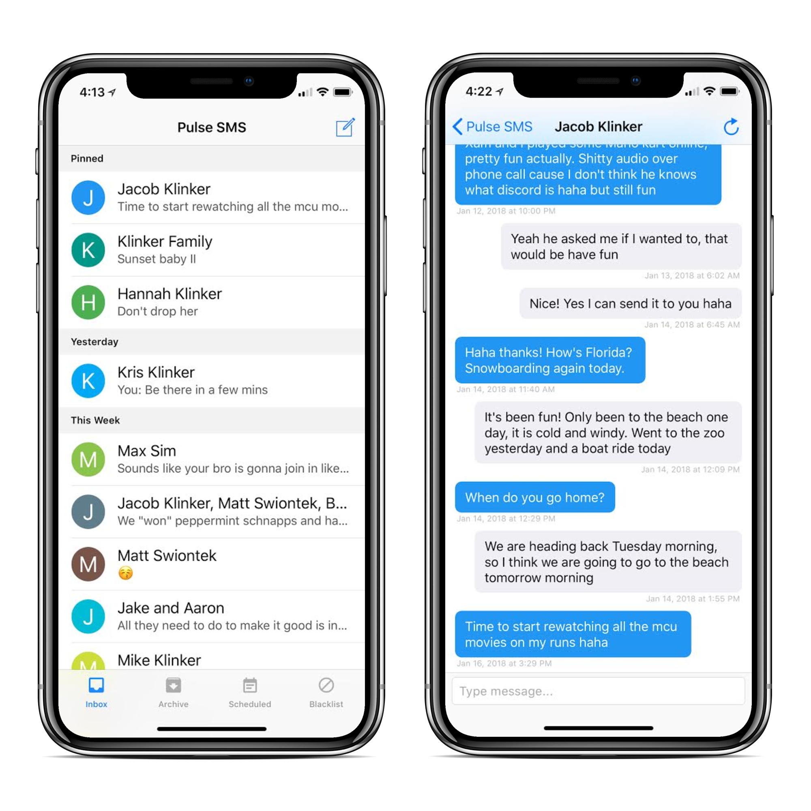

  

# Pulse SMS - iOS Client

This is a [Pulse SMS](https://messenger.klinkerapps.com/overview) client for iOS. This is **not** a replacement SMS app for your iPhone.

Pulse is a service that I built for Android. It is meant to allow you to use your personal phone number, when sending text messages from your computer, tablet, watch, tv, or any other device. As a backend service, it is really just a forwarding utility, based around Firebase Cloud Messaging. Since Android has exposed APIs to build a replacement SMS app, Pulse works as a normal SMS app on your phone, then any other device you are using use FCM to communicate directly and instantly with the Android phone app. Similarly, when messages are received to the phone, it will POST those message to the backend to get distributed to your other devices.

Pulse is not really a typical client-server application, since the phone is the controller and root of all the communication, but the service solves the issues around that, nicely.

**This iOS app is simply a client to the Pulse backend service.** It doesn't replace iMessage on your iPhone, and it doesn't allow you to text through the phone number associated with your iPhone. It acts like the Pulse web client would, or a tablet using Pulse. 

The use-cases for this iOS client, that I can see, are:

* Having an iPad and an Android phone and wanting to be able to use Pulse to text on the iPad
* Having a separate work iPhone that you want to be able to use with your personal Android phone number
* Demonstration of the APIs, their usage, and implementation for other third party clients

The app is not available on the Apple App Store, yet. I have a few things to finish, then I will be uploading it for Apple to approve.

## Building the App

Open the `Pulse.xcworkspace` in XCode to build and edit the project. You will need a developer license to build to a real device. You can build the app to the simulator if a device isn't available. The simulator will not have FCM functionality.

### Dependency Management

I use `CocoaPods` for dependency management. The `Pods` directory is checked in to source control, so unless you are adding or changing dependencies, you shouldn't have to worry about the setup here. 

To set up `CocoaPods`:

1. Run `sudo gem install cocoapods` to install `CocoaPods`.
2. Run `pod install` to install new pods to the project.
3. Run `pod update` if you are only updating the version of existing pods.

## Contributing

Please fork this repository and contribute back using [pull requests](https://github.com/klinker24/messenger-ios/pulls). Features can be requested using issues on our issue tracker page, rather than issues on this page: https://github.com/klinker-apps/messenger-issues.

## Changelog

The full changelog for the library can be found [here](CHANGELOG.md).

## License

    Copyright 2018 Luke Klinker

    Licensed under the Apache License, Version 2.0 (the "License");
    you may not use this file except in compliance with the License.
    You may obtain a copy of the License at

       http://www.apache.org/licenses/LICENSE-2.0

    Unless required by applicable law or agreed to in writing, software
    distributed under the License is distributed on an "AS IS" BASIS,
    WITHOUT WARRANTIES OR CONDITIONS OF ANY KIND, either express or implied.
    See the License for the specific language governing permissions and
    limitations under the License.
